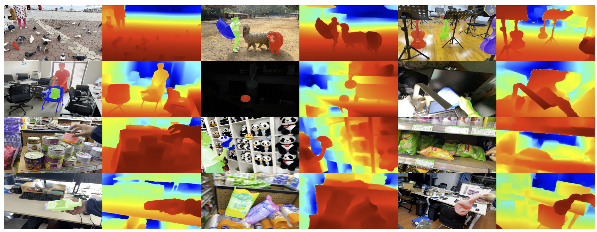

<div align="center">

## [CVPR 2023] ARKitTrack: A New Diverse Dataset for Tracking Using Mobile RGB-D Data

### [Project Page](https://arkittrack.github.io/) |  [arXiv](https://arkittrack.github.io/) |  [PDF](https://github.com/lawrence-cj/ARKitTrack/blob/master/figures/1438_arkittrack_a_new_diverse_datas-Camera-ready%20PDF.pdf)

</div>


This is a PyTorch implementation of the paper [ARKitTrack: A New Diverse Dataset for Tracking Using Mobile RGB-D Data](https://arkittrack.github.io/).Code will be released here.
Contact at: jschen@mail.dlut.edu.cn

<div class="is-size-5 publication-authors">
  <span class="author-block">
    <a href="https://scholar.google.com/citations?hl=en&user=rk1ozXMAAAAJ">Haojie Zhao</a><sup>*1</sup>,</span>
  <span class="author-block">
    <a>Junsong Chen</a><sup>*1</sup>,</span>
  <span class="author-block">
    <a href="http://faculty.dlut.edu.cn/wanglj/zh_CN/index.htm">Lijun Wang</a><sup>1</sup>,
  </span>
  <span class="author-block">
    <a href="https://scholar.google.com/citations?hl=en&user=D3nE0agAAAAJ">Huchuan Lu</a><sup>1,2</sup>,
  </span>
</div>

<div class="is-size-5 publication-authors">
<span class="author-block"><sup>1</sup>Dalian University of Technology, China,</span>
<span class="author-block"><sup>2</sup>Peng Cheng Laboratory, China</span>
</div>
<nobr>(* indicates equal contributions)</nobr>

### Citation
```
@article{zhao2023arkittrack,
      author = {Haojie Zhao and Junsong Chen and Lijun Wang and Huchuan Lu},
      title  = {ARKitTrack: A New Diverse Dataset for Tracking Using Mobile RGB-D Data},
      journal= {CVPR},
      year   = {2023},
}
```

### License

This project is under the MIT license. See [LICENSE](LICENSE) for details.
